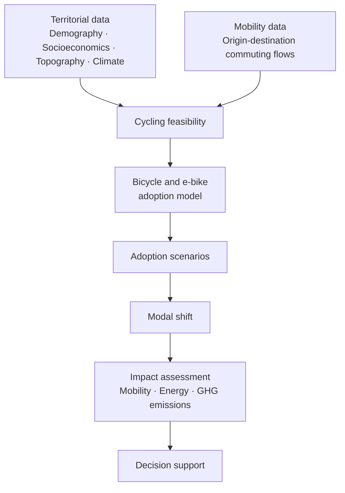

# Introduction

## What is HERMES?

**HERMES** is an open-source spatial simulation framework designed to model
bicycle and electric bicycle adoption and assess its potential impacts on
mobility, energy use and greenhouse gas emissions.

Rather than treating cycling potential as a simple function of distance,
HERMES combines demographic, socioeconomic, mobility, topographic, climatic
and spatial data to represent the territorial conditions that influence
whether a trip can realistically shift to bicycle or electric bicycle.

The framework is developed around a first case study in
**Villefranche-sur-Saône, France, and its surrounding mobility system**.

---

## Motivation

Increasing bicycle use can contribute to reducing transport energy demand
and greenhouse gas emissions while supporting more sustainable mobility
systems.

However, the potential for bicycle adoption is highly dependent on local
conditions.

Commuting distance, terrain, climate, existing mobility patterns and
socioeconomic characteristics can all influence whether cycling represents
a realistic alternative to current transport modes.

Although many of these variables are available through French open data,
they are distributed across heterogeneous datasets and spatial scales.

HERMES aims to integrate these sources into a reproducible simulation
framework capable of answering a central question:

> **Which trips could realistically shift to bicycle or electric bicycle,
> under which conditions, and with what potential impacts?**

---

## Research framework

HERMES distinguishes between two related but different concepts.

### Cycling feasibility

The first step is to determine whether a trip can reasonably be performed
by bicycle or electric bicycle.

Feasibility may depend on factors such as:

- travel distance;
- terrain and slope;
- climate;
- spatial configuration;
- transport infrastructure;
- characteristics of the origin and destination.

### Bicycle adoption

A feasible trip does not necessarily result in bicycle use.

The second step therefore models the conditions under which travellers may
adopt bicycle or electric bicycle for trips currently performed using other
transport modes.

This distinction allows HERMES to separate physical and territorial
constraints from behavioural adoption assumptions.

---

## Objectives

The objectives of HERMES are to:

- build a reproducible territorial database from official French open data;
- represent commuting relationships through origin-destination mobility flows;
- characterize the territorial feasibility of bicycle and electric bicycle
  trips;
- model alternative bicycle adoption scenarios;
- estimate the resulting modal shift;
- assess mobility, energy and greenhouse gas emission impacts;
- provide transparent and reproducible results for research and decision
  support.

---

## Initial case study

The first HERMES case study focuses on **Villefranche-sur-Saône and its
surrounding mobility system**.

The study area includes the municipalities and commuting relationships
required to represent mobility to and from the Villefranche-sur-Saône area.

This territory provides a useful experimental setting because it combines
urban, peri-urban and more topographically constrained environments.

The case study is used to develop and validate the HERMES methodology before
considering its application to other territories.

---

## Project overview

---

## Project status

HERMES is currently under active development.

The data engineering and territorial modelling foundations include:

- acquisition and preprocessing of official datasets;
- municipality-level demographic and socioeconomic integration;
- origin-destination commuting data;
- administrative geometries;
- climate data;
- high-resolution IGN RGE ALTI elevation data;
- construction of a case-study digital elevation model;
- reproducible dataset validation and loading utilities.

Current development focuses on deriving terrain indicators relevant to
cycling and progressively constructing the variables required for cycling
feasibility and adoption modelling.

Future stages will introduce:

- cycling feasibility indicators;
- bicycle and electric bicycle adoption models;
- scenario simulation;
- modal-shift estimation;
- energy and greenhouse gas impact assessment;
- spatial visualization and decision-support tools.