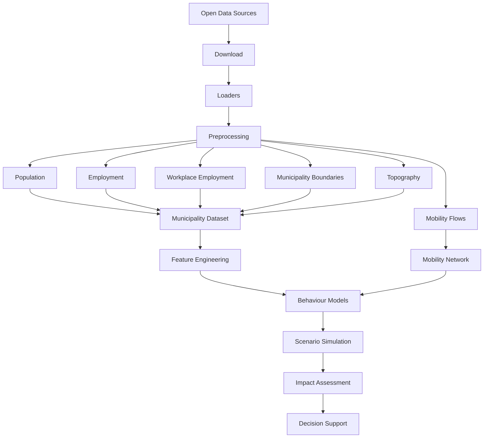

<div align="center">

# HERMES

### *Research for Mobility Evaluation and Simulation*

[]()
[]()
[]()
[]()
[]()

*Open-source research framework for urban mobility simulation*
*Urban Data Science • Sustainable Mobility • Energy Transition*

---

</div>


## Overview

HERMES is an open-source spatial simulation framework for modeling bicycle adoption and assessing its potential mobility, energy and climate impacts.

The project integrates demographic, socioeconomic, mobility, geospatial and environmental data to represent the territorial factors that influence the feasibility and adoption of cycling.

Its first case study focuses on Villefranche-sur-Saône and its surrounding mobility system, where HERMES is being developed to simulate bicycle and electric bicycle adoption under alternative scenarios.

Rather than producing a single predictive model, HERMES combines reproducible data engineering, spatial modelling and scenario simulation to explore how changes in mobility behaviour could affect transport patterns, energy demand and environmental impacts.

---

## Quick Start

### Clone the repository

```bash
git clone https://github.com/rsquaredata/hermes.git
cd hermes
```

### Create the environment

```bash
conda env create -f environment.yml
conda activate hermes
```

### Install the package

```bash
pip install -e .
```

### Launch Jupyter Lab

```bash
jupyter lab
```

Open the notebooks in the `notebooks/` directory to reproduce the complete data preparation workflow.

The current pipeline automatically:

- downloads public datasets
- preprocesses raw data
- builds standardized municipality-level tables
- exports integrated datasets in Parquet format

---

## Data Pipeline



---

## Current Datasets

The current data preparation pipeline includes:

| Dataset | Status |
|----------|--------|
| Population | ✅ |
| Employment | ✅ |
| Workplace Employment | ✅ |
| Mobility Flows | ✅ |
| Municipality Boundaries | ✅ |
| Topography | ✅ |
| Climate (SAFRAN/SIM) | ✅ |

---

## Current Outputs

The preprocessing pipeline currently produces the following standardized datasets:

- population.parquet
- employment.parquet
- workplace_employment.parquet
- mobility.parquet
- municipality_boundaries.parquet
- topography.parquet
- climate.parquet

These datasets constitute the territorial data layer used by the HERMES simulation engine.

---

## Initial Case Study

The first HERMES case study focuses on **Villefranche-sur-Saône (France) and its surrounding mobility system**.

The objective is to model the potential adoption of conventional and electric bicycles by accounting for territorial constraints and individual mobility conditions, including commuting patterns, distance, topography, climate and socioeconomic characteristics.

Alternative adoption scenarios will then be used to estimate their potential effects on mobility patterns, transport energy demand and climate-related impacts.

Villefranche-sur-Saône serves as the initial experimental territory for developing and validating the HERMES methodology, with the longer-term goal of making the framework transferable to other territories.

---

## Research Objectives

HERMES is driven by the following research objectives:

- develop reproducible urban simulation workflows
- integrate heterogeneous territorial datasets into a unified analytical framework
- estimate the potential impacts of sustainable mobility policies before implementation
- improve transparency and reproducibility of mobility simulations
- provide reusable data engineering tools for future urban studies

Rather than producing a single predictive model, HERMES aims to build a flexible simulation framework capable of supporting multiple modelling approaches and policy scenarios.

---

## Repository Structure

```
HERMES/
├── data/
│   ├── raw/
│   ├── prepared/
│   ├── features/
│   ├── dimensions/
│   ├── scenarios/
│   └── external/
│
├── notebooks/
│   ├── 00_data_preparation.ipynb
│   ├── municipality_table.ipynb
│   └── climate.ipynb
│
├── src/
│   └── hermes/
│       ├── preprocessing/
│       ├── integration/
│       ├── features/
│       ├── scenarios/
│       ├── simulation/
│       ├── raster/
│       ├── terrain/
│       ├── agents/
│       ├── sources/
│       └── ...
│
├── tests/
└── README.md
```

---

## Roadmap

### Territorial Data Layer

- [x] Population and socioeconomic data
- [x] Employment and commuting flows
- [x] Municipality boundaries
- [x] Climate data
- [x] High-resolution elevation data
- [ ] Terrain and cycling-relevant slope indicators
- [ ] Cycling infrastructure
- [ ] Land use and accessibility indicators

### Mobility Modelling

- [ ] Origin-destination mobility representation
- [ ] Cycling feasibility indicators
- [ ] Bicycle adoption model
- [ ] Electric bicycle adoption model
- [ ] Behavioural and territorial constraints

### Scenario Simulation

- [ ] Baseline mobility scenario
- [ ] Bicycle adoption scenarios
- [ ] Electric bicycle adoption scenarios
- [ ] Sensitivity analysis
- [ ] Spatial comparison of scenario outcomes

### Impact Assessment

- [ ] Modal shift
- [ ] Transport energy demand
- [ ] Greenhouse gas emissions
- [ ] Additional environmental and territorial impacts

### Decision Support

- [ ] Scenario comparison
- [ ] Spatial visualisation
- [ ] Interactive exploration tools

---

## Project Philosophy

HERMES follows a modular and reproducible design philosophy.

The project separates data acquisition, preprocessing, integration, modelling and simulation into independent components to facilitate reuse, transparency and future extensions.

All datasets originate from publicly available sources and can be automatically reproduced through the data pipeline.

---

## License

This project is released under the MIT License.

See the LICENSE file for details.

---

## Disclaimer

This project is intended for research, educational, and portfolio purposes.

Simulation results should be interpreted as decision-support estimates rather than exact forecasts and depend on the assumptions and quality of the underlying data.
<div align="center">

HERMES — Research for Mobility Evaluation and Simulation

</div>