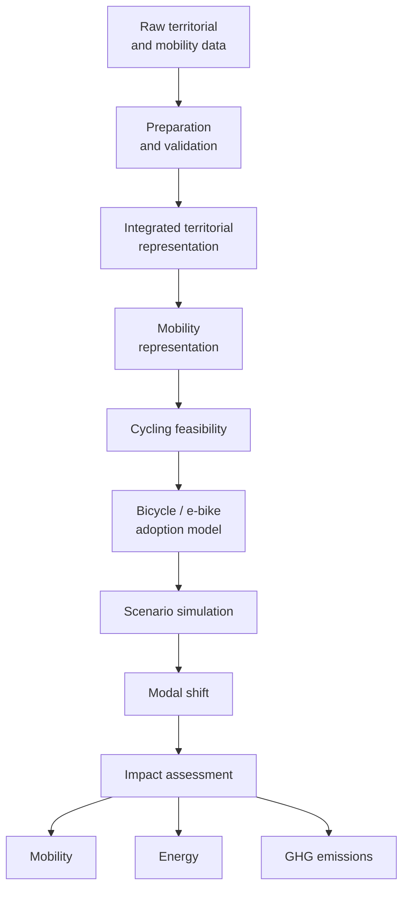

# Methodology

## Overview

HERMES follows a modular spatial modelling and simulation workflow designed
to estimate the potential adoption of bicycle and electric bicycle and assess
the resulting mobility, energy and climate impacts.

The methodology is organized into six main stages:

1. Data acquisition
2. Data preparation and integration
3. Mobility representation
4. Cycling feasibility modelling
5. Bicycle adoption and scenario simulation
6. Impact assessment

Each stage is designed to remain reproducible, testable and independently
extensible.

---

## 1. Data acquisition

HERMES primarily relies on official French open datasets.

Current sources include:

- INSEE;
- IGN;
- Météo-France;
- Data.gouv.fr and other official public-data services.

Raw datasets describe complementary dimensions of the territory, including:

- population;
- socioeconomic characteristics;
- employment;
- commuting flows;
- administrative geography;
- topography;
- climate.

Original files are preserved without modification to ensure that the complete
pipeline can be reproduced from source data.

---

## 2. Data preparation and integration

Each raw dataset undergoes an independent preprocessing pipeline.

Preparation includes:

- variable selection;
- column standardization;
- data-type harmonization;
- municipality identifier normalization;
- spatial reference-system harmonization where required;
- missing-value assessment;
- dataset validation.

Prepared municipality-level datasets are subsequently integrated using
official INSEE municipality codes.

Spatial datasets retain their geometries and coordinate reference systems
when required for downstream geospatial analysis.

---

## 3. Mobility representation

Mobility is represented using origin-destination commuting flows.

Each flow describes a relationship between:

- an origin municipality;
- a destination municipality;
- a number of commuters.

This representation differs from municipality-level attributes because
mobility describes interactions between places rather than properties of a
single municipality.

Origin-destination flows provide the basis for identifying trips that could
potentially shift from their current transport mode to bicycle or electric
bicycle.

---

## 4. Cycling feasibility

Before modelling adoption, HERMES evaluates whether a trip represents a
realistic candidate for cycling.

Cycling feasibility may depend on several dimensions.

### Distance

Longer trips generally impose a greater constraint on conventional bicycle
use, while electric bicycles can extend the range of feasible trips.

### Topography

Terrain influences the physical effort required for cycling.

HERMES uses high-resolution IGN RGE ALTI elevation data to derive terrain
indicators relevant to the study area.

The source elevation model is processed into a common analysis resolution
before slope-related indicators are derived.

### Climate

Weather and climatic conditions may influence the attractiveness and
practicality of cycling.

Climate indicators are therefore incorporated as territorial explanatory
variables.

### Spatial and infrastructure conditions

Future development will incorporate additional indicators describing the
built environment, accessibility and cycling infrastructure when suitable
data are available.

The output of this stage is not an adoption prediction.

It identifies the extent to which observed trips are compatible with bicycle
or electric bicycle use under defined assumptions.

---

## 5. Bicycle adoption and scenario simulation

Cycling feasibility defines what may be possible.

Adoption modelling addresses a different question:

> Among trips for which cycling is feasible, which ones may actually shift
> to bicycle or electric bicycle under a given scenario?

Adoption may depend on:

- trip characteristics;
- socioeconomic characteristics;
- territorial context;
- existing mobility behaviour;
- bicycle type;
- scenario assumptions.

HERMES will evaluate multiple scenarios rather than attempt to predict a
single deterministic future.

Scenarios may represent different assumptions regarding:

- conventional bicycle adoption;
- electric bicycle adoption;
- cycling infrastructure;
- behavioural response;
- territorial constraints.

This approach makes assumptions explicit and allows their consequences to be
compared systematically.

---

## 6. Modal shift

For each scenario, HERMES estimates the trips or commuting flows that shift
from an existing transport mode to bicycle or electric bicycle.

This stage translates adoption assumptions into changes in the mobility
system.

Relevant outputs may include:

- number of shifted trips;
- number of affected commuters;
- distance shifted by transport mode;
- spatial distribution of modal shift;
- bicycle versus electric bicycle adoption.

---

## 7. Impact assessment

Modal-shift results provide the basis for estimating downstream impacts.

### Mobility impacts

HERMES can quantify changes in transport-mode use and the spatial distribution
of bicycle adoption.

### Energy impacts

Changes in motorized travel can be translated into changes in transport
energy demand.

Electric bicycle energy consumption can also be incorporated where relevant.

### Climate impacts

Changes in travel activity and energy use can be translated into greenhouse
gas emission impacts using explicit emission assumptions.

Additional environmental, economic or territorial indicators may be
introduced in future versions without changing the core simulation workflow.

---

## Reproducibility

Reproducibility is a core design principle of HERMES.

Raw datasets are preserved and transformations are implemented through
version-controlled Python modules and notebooks.

Where scenario assumptions or modelling parameters cannot be derived directly
from observed data, they are explicitly documented.

This distinction between:

- observed data;
- derived indicators;
- model parameters;
- scenario assumptions;

is essential for interpreting simulation results transparently.

---

## Overall workflow

