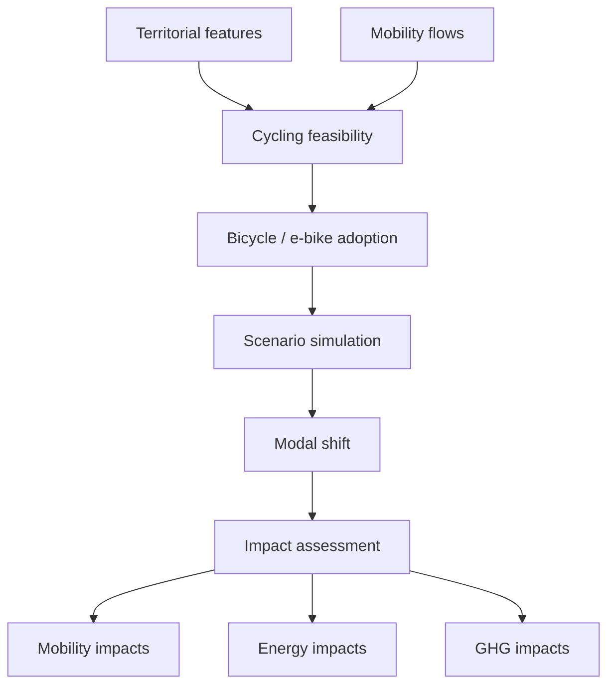

# Architecture

## Overview

HERMES follows a modular architecture designed to separate:

- configuration;
- data acquisition;
- dataset metadata;
- data preparation;
- geospatial processing;
- modelling;
- simulation;
- impact assessment;
- exploratory and validation workflows.

The objective is to keep the analytical pipeline reproducible while avoiding
the concentration of project logic inside notebooks.

Python modules implement reusable processing logic, while notebooks orchestrate
the workflow, inspect intermediate results and document methodological choices.

---

# Project structure

The project is organized around the following main directories:

```text
HERMES/
│
├── data/
│   ├── raw/
│   ├── prepared/
│   └── external/
│
├── docs/
│
├── figures/
│
├── notebooks/
│
├── src/
│   └── hermes/
│
├── tests/
│
├── README.md
└── pyproject.toml
```

The exact contents of these directories evolve as new components are added,
but their responsibilities remain distinct.

---

# Source package

Reusable project logic is implemented in:

```text
src/hermes/
```

The package contains modules with clearly separated responsibilities.

---

## `config.py`

`config.py` centralizes stable project paths and configuration values.

Examples include:

- raw-data directories;
- prepared-data directories;
- figure directories;
- dataset-specific storage locations;
- other project-wide constants.

Centralizing these paths prevents notebooks and processing modules from
reconstructing the project directory structure independently.

Conceptually:

```text
config.py
   │
   ├── RAW_DIR
   ├── PREPARED_DIR
   ├── FIGURES_DIR
   └── dataset-specific directories
```

---

## `data_catalog.py`

`data_catalog.py` describes the datasets used by HERMES.

The catalog acts as a registry between external data sources and their local
representation in the project.

Dataset definitions may include:

- dataset name;
- source organization;
- download URL;
- raw-data location;
- prepared-data location;
- format;
- expected columns;
- preparation function;
- validation information.

This allows datasets to be referenced by stable logical names rather than by
hard-coded URLs or file paths.

For example:

```python
dataset = get_dataset("population_raw")
```

The rest of the project can then use the catalog entry without needing to know
how or where the source is distributed.

---

## `utils.py`

`utils.py` contains generic technical utilities that are not specific to one
analytical domain.

Examples include:

- downloading files;
- downloading catalog datasets;
- archive inspection;
- archive extraction;
- preparation helpers;
- common file-handling operations.

These functions provide infrastructure used by domain-specific modules.

They should remain generic.

For example, downloading and extracting a `.7z` archive belongs in
`utils.py`, while interpreting the contents of an IGN RGE ALTI archive belongs
in the elevation module.

---

## Dataset preparation modules

Dataset-specific modules implement the transformation of raw source data into
standardized HERMES datasets.

Their responsibilities may include:

- loading source files;
- selecting relevant variables;
- harmonizing column names;
- converting data types;
- normalizing municipality identifiers;
- validating expected schemas;
- writing prepared datasets.

The objective is for each source dataset to have an explicit and reproducible
preparation pipeline.

---

## `elevation.py`

`elevation.py` contains terrain-processing logic associated with digital
elevation models, currently focused on IGN RGE ALTI.

Its responsibilities include:

- constructing the RGE ALTI tile grid;
- identifying required elevation tiles;
- indexing RGE ALTI archive contents;
- preparing case-study MNT tiles;
- locating elevation tiles from Lambert-93 coordinates;
- resampling elevation rasters;
- building the case-study DEM;
- computing terrain slope;
- comparing terrain statistics across spatial resolutions;
- deriving municipality-level terrain statistics for validation.

Generic archive handling remains in `utils.py`; only elevation-specific logic
belongs in `elevation.py`.

This separation follows the principle:

```text
utils.py
    │
    └── How do I extract an archive?

elevation.py
    │
    └── Which RGE ALTI files do I need,
        and how do I transform them into terrain information?
```

---

# Data architecture

HERMES distinguishes multiple data layers.


---

## Raw data

Raw data are stored under:

```text
data/raw/
```

These files represent downloaded source datasets as closely as possible to
their original form.

Raw data should not be manually edited.

Examples include:

- INSEE source files;
- IGN administrative data;
- Météo-France observations;
- RGE ALTI archives and extracted source tiles.

---

## Prepared data

Prepared datasets are stored under:

```text
data/prepared/
```

They contain standardized versions of raw datasets suitable for integration
and analysis.

Typical transformations include:

- column selection;
- schema normalization;
- type conversion;
- identifier harmonization;
- filtering;
- validation.

Prepared data remain conceptually close to their original source.

---

## Derived data

Some HERMES variables require transformations that go beyond source-data
preparation.

Examples include:

- origin-destination distances;
- digital elevation models;
- slope indicators;
- climate summaries;
- accessibility indicators;
- cycling-feasibility variables.

These derived products form the bridge between prepared source data and the
modelling layer.

As HERMES develops, derived datasets may be stored separately when doing so
improves reproducibility and avoids unnecessary recomputation.

---

# Notebook architecture

Notebooks are used as orchestration, exploration and validation documents.

They should not contain reusable project logic when that logic can reasonably
be implemented in the HERMES package.

A notebook may:

- request a dataset through the catalog;
- call a preparation function;
- invoke geospatial processing;
- inspect intermediate results;
- generate diagnostic figures;
- validate assumptions;
- document methodological decisions.

A notebook should generally not:

- implement reusable download logic;
- duplicate dataset paths;
- contain large domain-specific processing functions;
- reproduce functionality already available in `src/hermes/`.

The intended relationship is:

```text
Notebook
   │
   ├── orchestrates
   ▼
HERMES modules
   │
   ├── process
   ▼
Datasets
```

This keeps notebooks readable while making the underlying processing logic
testable and reusable.

---

# Spatial architecture

Geospatial processing is a central component of HERMES.

Different spatial representations are used depending on the analytical task.

---

## Municipality geometries

Municipality boundaries provide the territorial reference layer.

They are used for:

- study-area definition;
- spatial joins;
- raster masking;
- visualization;
- aggregation of territorial indicators.

---

## Origin-destination mobility

Commuting flows represent relationships between municipalities.

Conceptually:

```text
Origin municipality
        │
        │ commuters
        ▼
Destination municipality
```

This relational structure differs from ordinary municipality-level tables and
may also be represented as a directed weighted graph.

---

## Raster data

Continuous spatial phenomena such as elevation are represented using rasters.

For example:

```text
RGE ALTI 1 m tiles
        │
        ▼
Tile selection
        │
        ▼
Mosaic and resampling
        │
        ▼
HERMES DEM 10 m
        │
        ▼
Terrain indicators
```

Raster-derived information can subsequently be associated with territories or
mobility relationships.

---

# Modelling architecture

The future modelling layer is organized around a sequence of distinct
analytical components.



Keeping these stages separate is important because they answer different
questions.

---

## Cycling feasibility layer

The feasibility layer evaluates whether observed mobility relationships are
compatible with bicycle or electric bicycle use.

Potential inputs include:

- distance;
- terrain;
- climate;
- infrastructure;
- spatial context.

This layer describes constraints and opportunities rather than behavioural
adoption itself.

---

## Adoption layer

The adoption layer models the transition from feasible cycling opportunities
to potential bicycle or electric bicycle use.

It may combine:

- feasibility indicators;
- socioeconomic characteristics;
- mobility characteristics;
- behavioural assumptions.

The exact modelling approach will be determined during development.

---

## Simulation layer

The simulation layer applies explicit scenario assumptions to the adoption
model.

Rather than producing a single forecast, HERMES is designed to compare
alternative scenarios.

Simulation outputs feed the modal-shift and impact-assessment layers.

---

## Impact layer

The impact layer translates simulated mobility changes into interpretable
outcomes.

Initial target dimensions include:

- modal shift;
- transport energy demand;
- greenhouse gas emissions.

Additional indicators may be introduced later without changing the upstream
architecture.

---

# Dependency principles

HERMES follows a directional dependency structure.

High-level analytical components may depend on lower-level infrastructure,
but generic utilities should not depend on domain-specific modules.

For example:

```text
config
   ↑
data_catalog
   ↑
utils
   ↑
domain modules
   ↑
modelling
   ↑
simulation
   ↑
notebooks
```

The exact Python import graph does not need to reproduce this diagram
literally, but dependencies should remain as simple and directional as
possible.

In particular:

- generic utilities should not import notebook logic;
- dataset modules should not depend on simulation outputs;
- impact assessment should consume simulation results rather than alter
  upstream datasets.

---

# Design principles

The HERMES architecture follows several principles.

## Separation of concerns

Each module should have a clearly defined responsibility.

## Reusability

Reusable logic belongs in Python modules rather than notebooks.

## Reproducibility

Data transformations should be executable from original source data.

## Traceability

Derived variables should remain traceable to their source datasets and
processing steps.

## Modularity

New datasets, indicators or models should be addable without redesigning the
entire pipeline.

## Explicit assumptions

Observed data, derived variables, modelling parameters and scenario
assumptions should remain distinguishable.

## Transferability

Although HERMES is initially developed around Villefranche-sur-Saône, the
architecture should avoid unnecessary assumptions that prevent application to
other territories.

---

# Current implementation status

The current implementation primarily covers the data and geospatial
foundations of HERMES.

Implemented components include:

- project configuration;
- dataset cataloguing;
- reusable download and extraction utilities;
- dataset preparation pipelines;
- municipality-level data integration;
- origin-destination commuting data;
- administrative geometries;
- climate data preparation;
- RGE ALTI acquisition and tile selection;
- case-study DEM construction;
- terrain-processing utilities.

The cycling feasibility, adoption, scenario simulation and impact-assessment
layers remain under active development.