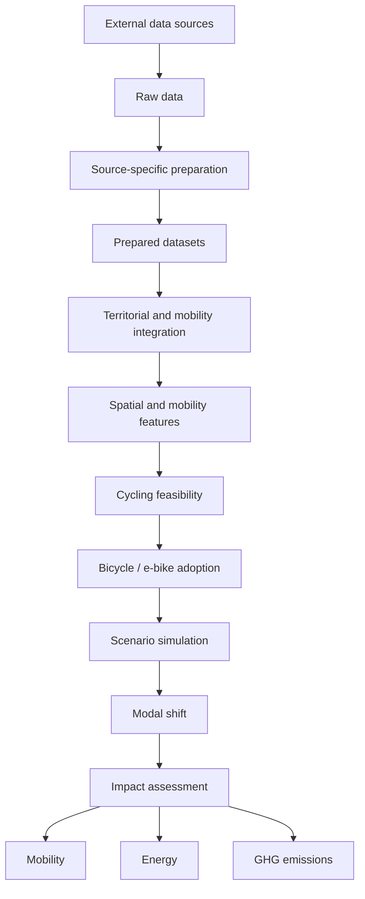
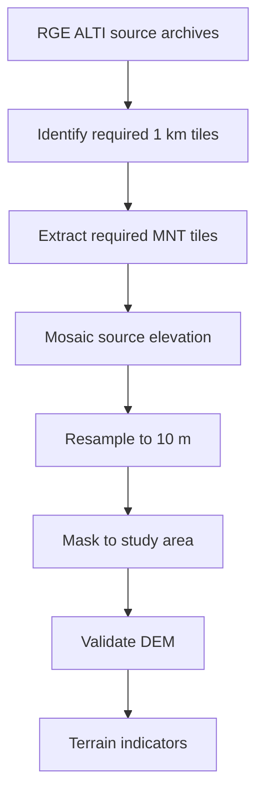

# Data Pipeline

## Overview

HERMES uses a reproducible data pipeline to transform heterogeneous French
open datasets into the spatial and mobility representations required for
bicycle-adoption simulation.

The pipeline separates:

1. data acquisition;
2. source-specific preparation;
3. territorial and mobility integration;
4. spatial feature engineering;
5. cycling feasibility modelling;
6. bicycle and electric bicycle adoption modelling;
7. scenario simulation;
8. impact assessment.

This separation makes it possible to reproduce, validate and extend each
stage independently.

---

# Pipeline principles

The HERMES pipeline follows several principles.

## Preserve raw data

Downloaded source files are retained as close as possible to their original
form.

Raw datasets are not manually edited as part of the analytical workflow.

## Separate preparation from modelling

Source-data cleaning and standardization are performed before modelling
features are constructed.

This prevents modelling assumptions from becoming embedded in basic data
preparation.

## Make transformations reproducible

Reusable transformations are implemented in version-controlled Python
modules.

Notebooks orchestrate these transformations and document validation and
methodological choices.

## Validate intermediate products

Datasets are checked before being passed to downstream stages.

Errors in identifiers, spatial coverage, schemas or raster processing should
therefore be detected as early as possible.

## Preserve provenance

Derived indicators should remain traceable to:

- their source dataset;
- their preparation pipeline;
- their transformation method;
- any modelling assumption involved.

---

# Overall pipeline



The first stages construct the analytical representation of the territory.

The later stages use this representation to simulate changes in mobility and
estimate their consequences.

---

# 1. Data acquisition

Dataset metadata are centralized in the HERMES data catalog.

A catalog entry can describe:

- the source organization;
- the download URL;
- the raw-data location;
- the prepared-data location;
- the file format;
- expected variables;
- preparation logic.

Datasets can therefore be accessed using stable logical identifiers rather
than hard-coded URLs and paths.

Conceptually:

```python
dataset = get_dataset("dataset_name")
```

Generic download and archive-handling operations are implemented through
reusable project utilities.

---

# 2. Raw data layer

Downloaded datasets are stored under the raw-data layer.

Examples include:

- INSEE statistical files;
- commuting-flow files;
- administrative geometries;
- Météo-France climate observations;
- IGN RGE ALTI archives and source elevation tiles.

The raw layer represents the reproducible starting point of the analytical
pipeline.

```text
External source
      │
      ▼
data/raw/
```

Large source datasets do not necessarily need to be fully extracted when only
a subset is required.

For example, HERMES identifies and extracts only the RGE ALTI elevation tiles
required for the study area and its processing context.

---

# 3. Source-specific preparation

Each dataset is prepared independently before integration.

Typical operations include:

- selecting relevant variables;
- standardizing column names;
- converting data types;
- harmonizing municipality identifiers;
- filtering the relevant study population;
- transforming coordinate reference systems;
- assessing missing values;
- validating expected schemas.

Prepared datasets should remain conceptually close to the information
provided by their original source.

---

# 4. Prepared data layer

Prepared datasets provide standardized inputs for downstream integration.

Examples include:

```text
population
employment
socioeconomic characteristics
commuting flows
municipality geometries
climate observations
```

Municipality-level tabular datasets primarily use official INSEE municipality
codes as stable identifiers.

Spatial datasets retain the geometries and coordinate reference systems
required for geospatial processing.

---

# 5. Territorial integration

Prepared municipality-level datasets are combined into a common territorial
representation.

Conceptually:

```text
Population ───────────┐
Employment ───────────┤
Socioeconomics ───────┼──► Territorial representation
Climate ──────────────┤
Geometry ─────────────┤
Terrain ──────────────┘
```

This layer describes the characteristics of the municipalities participating
in the case-study mobility system.

The territorial representation does not yet contain adoption predictions or
scenario assumptions.

---

# 6. Mobility integration

Commuting flows are handled separately because they represent relationships
between territories.

Each mobility observation links:

```text
Origin municipality
        │
        │ commuting flow
        ▼
Destination municipality
```

Origin-destination flows can be enriched with characteristics of both the
origin and destination.

This makes it possible to construct mobility-level features such as:

- origin characteristics;
- destination characteristics;
- distance;
- terrain constraints;
- climatic context;
- existing mobility characteristics.

These enriched flows form the main analytical units for future cycling
feasibility modelling.

---

# 7. Geospatial processing

Some modelling variables cannot be obtained through ordinary tabular joins.

HERMES therefore includes dedicated geospatial processing pipelines.

---

## Administrative geometry

Municipality boundaries are used to:

- construct the study area;
- perform spatial joins;
- transform coordinate systems;
- mask raster datasets;
- visualize spatial results.

Metric spatial operations are performed in **Lambert-93 (EPSG:2154)** where
appropriate.

---

## Elevation pipeline

Terrain processing currently uses IGN RGE ALTI data.

The elevation pipeline follows:



The source product has approximately 1 m spatial resolution.

HERMES constructs a 10 m digital elevation model to preserve meaningful
terrain detail while reducing computational cost for territorial mobility
analysis.

A limited amount of peripheral elevation context may be retained during
processing to support raster operations near study-area boundaries.

---

## Terrain feature engineering

The DEM provides the basis for deriving terrain variables relevant to cycling.

Potential derived variables include:

- slope;
- elevation gain;
- elevation loss;
- slope percentiles;
- exposure to steep terrain.

The final terrain representation used for mobility modelling will depend on
the analytical unit and cycling-feasibility methodology.

---

# 8. Feature engineering

Prepared and derived data are transformed into variables suitable for
modelling.

The feature-engineering layer may combine several dimensions.

### Mobility

- commuting distance;
- flow magnitude;
- origin-destination characteristics;
- existing transport behaviour.

### Territory

- demographic characteristics;
- socioeconomic characteristics;
- employment structure;
- spatial context.

### Terrain

- slope-related indicators;
- elevation change;
- topographic constraints.

### Climate

- temperature indicators;
- precipitation indicators;
- other relevant climatic characteristics.

Future datasets may add:

- cycling infrastructure;
- accessibility;
- land use;
- urban-form indicators.

---

# 9. Cycling feasibility

The first modelling stage evaluates whether observed trips are realistically
compatible with bicycle or electric bicycle use.

Conceptually:

```text
Mobility features
        +
Territorial features
        +
Terrain
        +
Climate
        │
        ▼
Cycling feasibility
```

Conventional bicycle and electric bicycle feasibility may differ because
electric assistance changes the effect of distance and terrain.

This stage represents constraints and opportunities.

It does not yet assume that a feasible traveller will actually adopt cycling.

---

# 10. Bicycle adoption

The adoption layer estimates potential behavioural change among trips or
travellers for which cycling is feasible.

Potential inputs include:

- cycling feasibility;
- socioeconomic characteristics;
- current mobility behaviour;
- territorial context;
- bicycle type;
- explicit behavioural assumptions.

The modelling methodology will be developed and evaluated during later
project stages.

The distinction between feasibility and adoption is fundamental:

```text
Feasible
   ≠
Automatically adopted
```

---

# 11. Scenario simulation

HERMES is designed to explore alternative scenarios rather than produce one
deterministic forecast.

A scenario specifies assumptions affecting bicycle or electric bicycle
adoption.

The same territorial and mobility baseline can therefore be evaluated under
multiple assumptions.

```text
Baseline mobility
       │
       ├──► Scenario A
       ├──► Scenario B
       └──► Scenario C
                 │
                 ▼
          Compare outcomes
```

Scenario parameters must remain explicit and separate from observed source
data.

---

# 12. Modal-shift estimation

Scenario outputs are translated into changes in transport-mode use.

Potential outputs include:

- commuters shifting mode;
- trips shifted to bicycle;
- trips shifted to electric bicycle;
- kilometres shifted from motorized modes;
- spatial distribution of modal shift.

This stage connects adoption modelling with downstream impact assessment.

---

# 13. Impact assessment

Modal-shift outputs are translated into impacts.

## Mobility impacts

Examples include:

- changes in modal shares;
- cycling activity;
- affected commuting flows;
- spatial distribution of mobility changes.

## Energy impacts

Reduced motorized travel can alter transport energy demand.

Electric bicycle electricity consumption can also be incorporated where
relevant.

## Climate impacts

Changes in vehicle travel and energy use can be translated into greenhouse
gas emission changes using documented assumptions and emission factors.

Additional impact dimensions may be incorporated later.

---

# 14. Validation

Validation occurs throughout the pipeline rather than only after modelling.

---

## Tabular validation

Checks may include:

- expected columns;
- data types;
- identifier formats;
- duplicate identifiers;
- missing values;
- expected value ranges.

---

## Mobility validation

Checks may include:

- valid origin identifiers;
- valid destination identifiers;
- non-negative flow values;
- study-area coverage;
- origin-destination consistency.

---

## Spatial validation

Checks may include:

- coordinate reference systems;
- geometry validity;
- spatial extent;
- expected intersections;
- distance consistency.

---

## Raster validation

Checks may include:

- CRS;
- spatial resolution;
- raster dimensions;
- NoData handling;
- expected elevation ranges;
- study-area coverage.

These checks are particularly important for terrain variables because
downstream slope calculations depend directly on the quality of the elevation
model.

---

# 15. Caching and recomputation

Some HERMES transformations are computationally expensive.

Examples include:

- archive extraction;
- raster mosaicking;
- raster resampling;
- spatial feature derivation.

Intermediate products may therefore be persisted when this improves
reproducibility and avoids unnecessary computation.

Reusable preparation functions should detect existing valid products where
appropriate instead of repeating expensive operations without reason.

---

# 16. Reproducible execution

The intended execution pattern is:

```text
Data catalog
     │
     ▼
Download / locate source
     │
     ▼
Prepare dataset
     │
     ▼
Validate
     │
     ▼
Integrate
     │
     ▼
Derive features
     │
     ▼
Model
     │
     ▼
Simulate
     │
     ▼
Assess impacts
```

Python modules contain reusable processing logic.

Notebooks call these modules to:

- execute pipeline stages;
- inspect results;
- validate intermediate products;
- document methodological decisions.

This separation allows the complete HERMES workflow to evolve without turning
individual notebooks into monolithic processing scripts.

---

# Current pipeline status

The following foundations are currently implemented or under active
development:

- [x] Dataset catalog
- [x] Reusable data-download utilities
- [x] Archive inspection and extraction
- [x] Population preparation
- [x] Employment and socioeconomic preparation
- [x] Commuting-flow preparation
- [x] Administrative geometries
- [x] Climate-data preparation
- [x] RGE ALTI tile selection and extraction
- [x] Case-study DEM at 10 m
- [x] DEM spatial validation
- [ ] Production terrain features
- [ ] Mobility-level feature engineering
- [ ] Cycling feasibility model
- [ ] Bicycle adoption model
- [ ] Electric bicycle adoption model
- [ ] Scenario simulation
- [ ] Modal-shift estimation
- [ ] Energy impact assessment
- [ ] GHG impact assessment