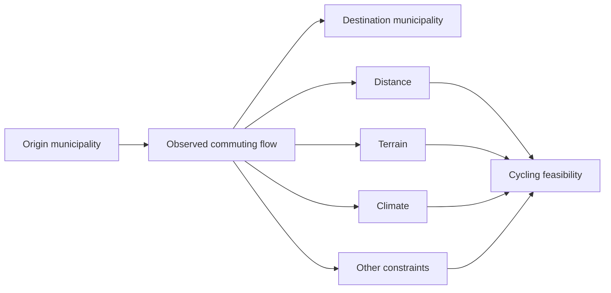
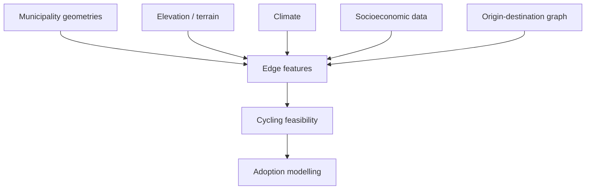

# Mobility Graph

## Overview

HERMES represents commuting relationships between municipalities as a
**directed weighted graph**.

The graph provides a structural representation of the mobility system
surrounding Villefranche-sur-Saône.

In this representation:

- municipalities are nodes;
- origin-destination commuting flows are directed edges;
- edge weights represent commuting intensity;
- node attributes describe territorial characteristics;
- edge attributes describe mobility relationships and derived features.

The graph complements tabular origin-destination data by making the structure
of the mobility system explicit.

---

# Why use a graph?

Municipality-level datasets describe individual territories.

Commuting data describe something fundamentally different: **relationships
between territories**.

A municipality may simultaneously:

- generate outgoing commuting flows;
- receive incoming commuting flows;
- connect to multiple destinations;
- occupy a central or peripheral position in the mobility system.

A graph provides a natural representation of these interactions.

```text
Municipality A
      │
      │ commuters
      ▼
Municipality B
      │
      │ commuters
      ▼
Municipality C
```

The direction of each edge matters because commuting from municipality A to
municipality B is not equivalent to commuting from B to A.

---

# Graph structure

The HERMES mobility graph can be represented as:

\[
G = (V, E)
\]

where:

- \(V\) is the set of municipalities;
- \(E\) is the set of observed origin-destination commuting relationships.

Each directed edge:

\[
e_{ij} \in E
\]

represents commuting from origin municipality \(i\) to destination
municipality \(j\).

---

# Nodes

Each node represents a municipality identified by its official INSEE code.

Node attributes may include territorial characteristics such as:

- municipality name;
- population;
- employment;
- socioeconomic indicators;
- geographic characteristics;
- climate indicators;
- terrain indicators;
- other contextual variables.

Conceptually:

```text
Municipality node
│
├── INSEE code
├── population
├── employment
├── socioeconomic characteristics
├── climate
└── territorial features
```

Node attributes describe the places connected by mobility flows.

They do not by themselves describe the characteristics of a particular trip
between two municipalities.

---

# Edges

Each directed edge represents an observed origin-destination commuting flow.

Basic edge attributes may include:

- origin municipality;
- destination municipality;
- number of commuters;
- available transport-mode information;
- other characteristics provided by the commuting dataset.

Conceptually:

```text
Origin municipality
        │
        │ commuting flow
        │
        │ weight = commuters
        ▼
Destination municipality
```

The number of commuters provides a natural edge weight representing the
magnitude of the observed relationship.

---

# Derived edge features

The graph can be enriched with variables derived from spatial and territorial
data.

These features describe the relationship between an origin and a destination
rather than either municipality in isolation.

Potential edge-level features include:

- origin-destination distance;
- elevation difference;
- elevation gain and loss;
- slope-related indicators;
- climatic context;
- origin characteristics;
- destination characteristics;
- infrastructure characteristics.

These derived features will provide part of the analytical representation
used for cycling feasibility modelling.

---

# Mobility and cycling feasibility

The mobility graph provides the set of observed commuting relationships that
HERMES can evaluate as potential candidates for bicycle or electric bicycle
use.

For each relevant edge, HERMES can conceptually ask:

> Is this commuting relationship compatible with bicycle or electric bicycle
> use given its distance, terrain and territorial conditions?

This produces a cycling-feasibility representation associated with the
mobility network.



Feasibility does not imply adoption.

It describes whether a mobility relationship represents a realistic candidate
for cycling under defined assumptions.

---

# Conventional bicycle and electric bicycle

HERMES distinguishes between conventional bicycle and electric bicycle
because the constraints associated with a mobility relationship may affect
them differently.

For example:

- distance may limit conventional bicycle use more strongly;
- steep terrain may impose a stronger constraint on conventional cycling;
- electric assistance may increase the range of feasible commuting
  relationships.

The same origin-destination edge may therefore have different feasibility
characteristics for bicycle and electric bicycle.

---

# From feasibility to adoption

The graph represents observed mobility and its territorial context.

Adoption modelling introduces an additional behavioural layer.

Conceptually:

```text
Observed OD flow
      │
      ▼
Mobility and territorial features
      │
      ▼
Cycling feasibility
      │
      ▼
Adoption model
      │
      ▼
Scenario-specific modal shift
```

This distinction prevents physical or spatial feasibility from being confused
with actual behavioural change.

---

# Scenario representation

Future HERMES scenarios may associate adoption outcomes with graph edges.

For example, an edge may contain:

```text
baseline_commuters
bicycle_feasibility
ebike_feasibility
bicycle_adoption
ebike_adoption
shifted_commuters
```

Scenario results can therefore be represented on the same mobility structure
as the observed baseline.

This makes it possible to compare:

- baseline commuting flows;
- potential cycling flows;
- scenario-specific adoption;
- resulting modal shift.

---

# Graph analysis

Graph methods can also be used to characterize the structure of the mobility
system.

Potential analyses include:

- weighted in-degree;
- weighted out-degree;
- centrality;
- mobility hubs;
- strongly connected components;
- community structure;
- concentration of commuting flows.

These indicators may help describe the case-study mobility system.

However, graph metrics are not assumed to be useful modelling features by
default.

Their inclusion in cycling feasibility or adoption models should depend on
their analytical relevance and empirical evaluation.

---

# Spatial interpretation

The graph is relational rather than purely geographic.

Two municipalities can be strongly connected by commuting even when they are
not adjacent.

Conversely, neighbouring municipalities may have weak commuting
relationships.

This distinction is important:

```text
Administrative adjacency
        ≠
Observed mobility relationship
```

HERMES therefore combines the mobility graph with geospatial information
rather than treating one as a substitute for the other.

---

# Relationship with geospatial data

Graph edges can be enriched using spatial information from the HERMES
territorial data layer.



This integration between network structure and geographic information is a
central component of HERMES.

---

# Graph construction

The mobility graph is constructed from prepared origin-destination commuting
data.

A typical construction process is:

1. load validated commuting flows;
2. identify origin and destination municipality codes;
3. create municipality nodes;
4. create directed edges for observed flows;
5. assign commuting intensity as an edge weight;
6. attach available territorial attributes;
7. validate graph structure.

Derived spatial features can then be added independently.

This separation prevents graph construction from becoming dependent on every
future modelling feature.

---

# Validation

The mobility graph should be validated before being used downstream.

Potential checks include:

- every edge has a valid origin;
- every edge has a valid destination;
- municipality identifiers are consistent with the territorial reference;
- commuting weights are non-negative;
- expected municipalities are represented;
- total graph flows remain consistent with the prepared source dataset;
- self-loops are handled explicitly;
- isolated nodes are identified where relevant.

Validation ensures that converting tabular commuting data into a graph does
not alter the underlying mobility information.

---

# Self-loops

Some commuting observations may represent people living and working within
the same municipality.

These relationships correspond to graph self-loops:

```text
Municipality A
      ↺
```

They should not automatically be discarded.

Intra-municipality commuting may be particularly relevant to cycling because
such trips can involve relatively short travel distances.

However, municipality-level origin-destination data do not provide the exact
start and end points of these trips.

Their treatment therefore requires explicit methodological assumptions and
may differ from inter-municipality flows.

---

# Limitations

The mobility graph inherits the limitations of aggregated commuting data.

An edge between two municipalities does not represent an exact route.

It does not directly provide:

- household-level origin coordinates;
- workplace coordinates;
- actual road itineraries;
- individual route choice;
- exact travelled distance;
- exact slope experienced by each commuter.

Consequently, spatial features associated with edges may require
approximations or additional routing data.

These assumptions must remain explicit when interpreting cycling-feasibility
results.

---

# Current status

The HERMES mobility representation is based on prepared INSEE
origin-destination commuting flows.

Current and upcoming development includes:

- [x] commuting-flow acquisition;
- [x] commuting-flow preparation;
- [x] municipality identifier harmonization;
- [ ] production mobility graph;
- [ ] graph validation;
- [ ] origin-destination distance features;
- [ ] terrain-aware edge features;
- [ ] cycling-feasibility attributes;
- [ ] bicycle and electric bicycle adoption attributes;
- [ ] scenario-specific modal-shift attributes.

The graph is intended to remain a reusable representation of the observed
mobility system while modelling components are progressively added around it.