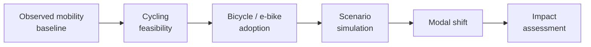
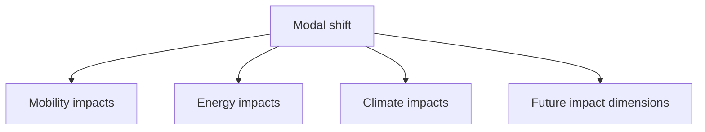

# Simulation Framework

## Overview

The simulation framework is the analytical core of HERMES.

Its objective is to explore how bicycle and electric bicycle adoption could
modify commuting behaviour and to estimate the resulting mobility, energy
and climate impacts.

HERMES does not attempt to predict a single deterministic future.

Instead, it combines:

- observed territorial and mobility data;
- cycling-feasibility indicators;
- adoption models or assumptions;
- explicit scenario parameters;
- impact-assessment models.

Alternative scenarios can therefore be evaluated from a common observed
baseline.



---

# Simulation philosophy

HERMES follows a **scenario-based simulation approach**.

The purpose of the framework is not to claim that a specific number of
commuters will inevitably adopt cycling.

Instead, HERMES asks:

> Given the observed mobility system and territorial constraints, what could
> happen under different assumptions about bicycle and electric bicycle
> adoption?

This distinction is important because future mobility behaviour cannot be
derived directly from territorial data alone.

Scenario assumptions therefore remain explicit and separate from observed
data.

---

# Baseline mobility system

Every simulation begins from an observed mobility baseline.

The baseline is constructed from prepared origin-destination commuting data
and describes the existing relationships between residence and workplace
municipalities.

Conceptually:

```text
Origin
  │
  │ observed commuters
  ▼
Destination
```

The baseline may contain information about:

- number of commuters;
- origin municipality;
- destination municipality;
- existing transport behaviour;
- origin and destination characteristics;
- spatial and terrain features.

Scenario results are evaluated relative to this baseline.

---

# Cycling feasibility

Before simulating adoption, HERMES evaluates whether an observed mobility
relationship represents a realistic candidate for bicycle or electric
bicycle use.

Feasibility may depend on:

- travel distance;
- terrain and slope;
- climate;
- infrastructure;
- spatial context;
- other physical or territorial constraints.

This stage answers:

> **Could this trip reasonably be made by bicycle or electric bicycle?**

It does not answer:

> **Will the traveller actually adopt cycling?**

The distinction between feasibility and adoption is a core principle of the
simulation framework.

---

# Bicycle and electric bicycle feasibility

Conventional bicycle and electric bicycle are modelled separately where
appropriate.

Electric assistance changes some of the constraints associated with cycling.

For example:

- longer distances may remain feasible by electric bicycle;
- steep terrain may impose a weaker constraint;
- elevation gain may affect conventional and electric bicycle differently.

An origin-destination relationship may therefore be:

- feasible for both bicycle and electric bicycle;
- feasible primarily for electric bicycle;
- infeasible for either under the selected assumptions.

The exact feasibility methodology will be defined and validated during model
development.

---

# Adoption modelling

Feasibility alone does not determine behaviour.

Among trips that could potentially be made by bicycle, only a fraction may
actually shift mode.

The adoption layer therefore estimates or simulates behavioural change using
available evidence and explicit assumptions.

Potential adoption factors include:

- cycling feasibility;
- socioeconomic characteristics;
- existing mobility behaviour;
- territorial context;
- bicycle type;
- infrastructure;
- scenario parameters.

Conceptually:

```text
Observed trip
     │
     ▼
Feasible?
     │
     ├── No ─────► No simulated cycling adoption
     │
     └── Yes
           │
           ▼
     Adoption model
           │
           ▼
     Scenario outcome
```

The modelling approach may evolve as the project develops.

Possible approaches include statistical models, rule-based models,
probabilistic models or combinations of these methods.

The choice should depend on available data and validation evidence rather
than on a predetermined modelling technique.

---

# Scenario definition

A HERMES scenario represents a coherent set of assumptions about bicycle or
electric bicycle adoption.

A scenario may modify parameters such as:

- adoption probability;
- maximum or effective cycling distance;
- conventional bicycle versus electric bicycle uptake;
- sensitivity to terrain;
- infrastructure availability;
- behavioural response.

Scenarios should be interpretable and their assumptions explicitly
documented.

For example:

```text
Observed baseline
      │
      ├──► Conservative adoption
      │
      ├──► Moderate adoption
      │
      └──► High adoption
```

These labels should only be used when their underlying assumptions are
precisely defined.

---

# Scenario parameters

Scenario parameters belong to a different conceptual layer from observed
data.

HERMES distinguishes:

```text
Observed data
     │
     ├── commuting flows
     ├── population
     ├── terrain
     ├── climate
     └── socioeconomic characteristics

Derived indicators
     │
     ├── distance
     ├── slope
     └── cycling feasibility

Model parameters
     │
     └── estimated from data where possible

Scenario assumptions
     │
     └── explicitly chosen values

Simulation outputs
     │
     └── consequences of those assumptions
```

Maintaining this distinction is essential for transparent interpretation of
simulation results.

---

# Simulation unit

The primary simulation unit is expected to be based on observed
origin-destination commuting relationships.

For an edge between municipalities \(i\) and \(j\), let:

\[
N_{ij}
\]

represent the observed number of commuters.

A simplified scenario could associate this flow with an adoption rate:

\[
p_{ij}^{(s)}
\]

for scenario \(s\).

The expected number of commuters shifting to cycling would then be:

\[
C_{ij}^{(s)} = N_{ij} \times p_{ij}^{(s)}
\]

where \(p_{ij}^{(s)}\) may depend on feasibility, traveller characteristics
and scenario assumptions.

This expression illustrates the conceptual structure only.

The final adoption model may use a more detailed formulation.

---

# Probabilistic simulation

Bicycle adoption is inherently uncertain.

Where appropriate, HERMES may represent adoption probabilistically rather
than assigning every flow a deterministic outcome.

For example:

\[
P(A_{ij}=1)
=
f(X_{ij}, T_i, T_j, S)
\]

where:

- \(A_{ij}\) represents cycling adoption;
- \(X_{ij}\) represents mobility characteristics;
- \(T_i\) and \(T_j\) represent territorial characteristics;
- \(S\) represents scenario assumptions.

Probabilistic modelling would allow HERMES to represent uncertainty and
variation between otherwise similar mobility relationships.

The exact formulation remains part of future model development.

---

# Modal-shift estimation

Adoption outputs are translated into changes in transport-mode use.

For each scenario, HERMES aims to estimate quantities such as:

- commuters shifting to conventional bicycle;
- commuters shifting to electric bicycle;
- trips shifted from motorized transport;
- vehicle kilometres avoided;
- bicycle kilometres generated;
- electric bicycle kilometres generated.

Conceptually:

```text
Adoption outcome
      │
      ▼
Original transport mode
      │
      ▼
Modal shift
      │
      ├──► Bicycle
      └──► Electric bicycle
```

Modal shift provides the link between behavioural simulation and impact
assessment.

---

# Impact assessment

The simulation framework separates adoption from its consequences.

This allows different impact models to consume the same modal-shift results.



---

## Mobility impacts

Mobility outputs may include:

- number of shifted commuters;
- number of shifted trips;
- bicycle kilometres;
- electric bicycle kilometres;
- reduction in motorized travel;
- changes in modal shares;
- spatial distribution of adoption.

These indicators describe how the simulated mobility system differs from the
observed baseline.

---

## Energy impacts

Energy impacts are downstream consequences of simulated modal shift.

Potential calculations include:

- avoided fuel consumption;
- avoided electricity consumption from displaced motorized travel where
  relevant;
- electricity consumption associated with electric bicycles;
- net changes in transport energy demand.

Energy is therefore an **impact dimension** in HERMES rather than the direct
quantity being simulated by the core adoption model.

---

## Climate impacts

Changes in transport activity can be translated into greenhouse gas emission
impacts.

Potential calculations may account for:

- avoided vehicle kilometres;
- transport-mode-specific emission factors;
- energy consumption;
- electric bicycle electricity use;
- relevant lifecycle assumptions where appropriate.

All emission factors and methodological assumptions should remain explicit
and traceable.

---

# Spatial outputs

Because HERMES is built around a spatial mobility system, simulation results
can be analysed geographically.

Potential outputs include:

- adoption by origin municipality;
- adoption by destination municipality;
- affected commuting corridors;
- spatial distribution of modal shift;
- energy impacts by territory;
- greenhouse gas impacts by territory.

This allows aggregate scenario results to be interpreted alongside their
territorial distribution.

---

# Aggregation

Simulation outputs may be aggregated at several levels.

### Mobility-flow level

Individual origin-destination relationships.

### Municipality level

Results grouped by origin or destination municipality.

### Study-area level

Aggregate effects across the complete HERMES case study.

Maintaining the most detailed practical simulation output before aggregation
helps preserve analytical flexibility.

---

# Uncertainty

HERMES should not present scenario outputs as precise forecasts.

Uncertainty may arise from:

- aggregated mobility data;
- unknown exact routes;
- modelling assumptions;
- behavioural variability;
- adoption parameters;
- emission factors;
- future infrastructure conditions.

Future development may therefore include:

- sensitivity analysis;
- parameter ranges;
- Monte Carlo simulation;
- confidence or uncertainty intervals;
- comparison of alternative model specifications.

---

# Sensitivity analysis

Sensitivity analysis will be important for identifying which assumptions have
the greatest influence on HERMES results.

Potential parameters include:

- cycling-distance thresholds;
- terrain sensitivity;
- electric bicycle range;
- adoption probabilities;
- infrastructure assumptions;
- energy factors;
- emission factors.

This can help distinguish robust scenario conclusions from results that depend
strongly on uncertain assumptions.

---

# Explainability

Transparency is a core requirement of the simulation framework.

A result should be traceable through the complete analytical chain:

```text
Source data
    │
    ▼
Prepared data
    │
    ▼
Derived features
    │
    ▼
Cycling feasibility
    │
    ▼
Adoption model
    │
    ▼
Scenario assumptions
    │
    ▼
Modal shift
    │
    ▼
Impact calculation
```

Where possible, HERMES should make it possible to identify why a particular
mobility relationship receives a given feasibility or adoption outcome.

---

# Reproducibility

Every simulation should be reproducible from:

- a defined version of the input datasets;
- a defined model configuration;
- explicit scenario parameters;
- documented impact factors;
- a fixed random seed where stochastic simulation is used.

Simulation outputs should preserve sufficient metadata to identify the
conditions under which they were generated.

---

# Model validation

Different components require different validation strategies.

## Feasibility validation

The plausibility of distance, terrain and other feasibility constraints
should be evaluated against available evidence and known cycling behaviour.

## Adoption-model validation

Where observed adoption data are available, predictive or probabilistic
models should be evaluated using appropriate validation procedures.

## Scenario validation

Scenarios themselves are not predictions to be validated as true or false.

Instead, their assumptions should be:

- explicit;
- internally consistent;
- empirically informed where possible;
- interpretable.

## Impact-model validation

Energy and climate calculations should use documented factors and be checked
against established methodologies where available.

---

# Current status

The simulation framework is currently under development.

The present HERMES implementation provides much of the upstream data
foundation required for simulation.

Current status:

- [x] Territorial data acquisition
- [x] Municipality-level data preparation
- [x] Origin-destination commuting data
- [x] Administrative geometries
- [x] Climate-data preparation
- [x] High-resolution elevation acquisition
- [x] Case-study DEM construction
- [ ] Production terrain features
- [ ] Origin-destination spatial features
- [ ] Cycling-feasibility model
- [ ] Bicycle adoption model
- [ ] Electric bicycle adoption model
- [ ] Scenario engine
- [ ] Modal-shift estimation
- [ ] Energy impact model
- [ ] GHG impact model
- [ ] Uncertainty and sensitivity analysis

---

# Long-term development

Future development may extend the simulation framework with:

- improved behavioural models;
- route-aware cycling constraints;
- cycling-infrastructure scenarios;
- stochastic simulation;
- Monte Carlo uncertainty analysis;
- sensitivity analysis;
- additional environmental impacts;
- economic impact indicators;
- interactive scenario comparison.

These extensions should preserve the core HERMES principle:

> **Observed data, modelling assumptions, scenario choices and simulated consequences must remain explicitly distinguishable.**